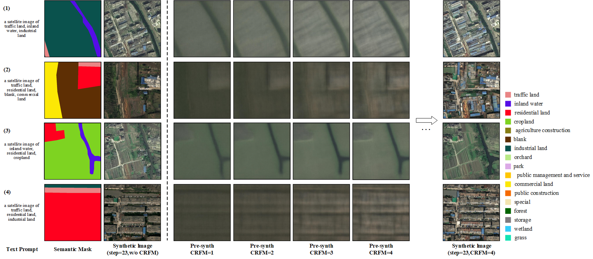
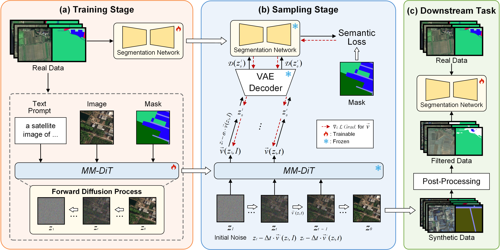

# Task-Oriented Data Synthesis and Control-Rectify Sampling for Remote Sensing Semantic Segmentation

<div >
  <a href='https://arxiv.org/abs/2512.16740'></a>
</div>

<br>

> **Control Rectified Flow Matching(CRFM)**
> <br>
> Yunkai Yang, [Yudong Zhang](https://yudongzhang.com/), Kunquan Zhang, Jinxiao Zhang, Xinying Chen, [Haohuan Fu](https://www.thuhpgc.net/author/haohuan-fu/), [Runmin Dong](https://dongrunmin.github.io)$^*$
> <br>
> Sun Yat-sen University & Tsinghua University

<br>

<p align="center">
  
</p>

## Overview

<p align="center">
  
</p>

The overall workflow of the task-oriented data synthesis framework (TODSynth) consists of three stages: (a) Training stage using an MM-DiT generative model conditioned on text and mask. (b) Sampling stage with the proposed control-rectify flow matching (CRFM). (c) Downstream tasks trained on a combination of real and synthetic data.

## Environment setup

```bash
conda create -n crfm python=3.11
conda activate crfm
pip install -r requirements.txt
pip3 install -U openmim
mim install mmengine
mim install "mmcv==2.1.0" 
pip3 install "mmsegmentation>=1.0.0"
pip install xformers
```

### Optional (if mmengine throws an error)
Then modify the loading logic of the `load_from_local` function located in `mmengine/runner/checkpoint.py` as:
```python
def load_from_local(filename, map_location):
    """Load checkpoint by local file path.

    Args:
        filename (str): local checkpoint file path
        map_location (str, optional): Same as :func:`torch.load`.

    Returns:
        dict or OrderedDict: The loaded checkpoint.
    """
    filename = osp.expanduser(filename)
    if not osp.isfile(filename):
        raise FileNotFoundError(f'{filename} can not be found.')
    checkpoint = torch.load(filename, map_location=map_location, weights_only=False)
    return checkpoint
```

## Download Models

1. **Stable Diffusion 3.5**

```bash
huggingface-cli download stabilityai/stable-diffusion-3.5-medium --local-dir ./sd3.5_medium
```

## Prompts vectorization

For the purpose of saving GPU memory, it's necessary to vectorize the prompts before running the model. Then execute the following command:

```bash
  python preprocess/vectorize.py \
    --pretrained_model_name_or_path sd3.5_medium \
    --data_root demo \
    --src_json_file index.jsonl \
    --out_json_file index_.jsonl
```

After running the above command, a new dataset index file `index_.jsonl` will be generated to be used for subsequent model inference and training.

## Dataset preparation

You need to organize your dataset in the following format:

```angular2html
├── demo
│  ├── demo_img/             # Training-set images
│  ├── demo_label/           # Semantic masks for the training set
│  ├── index.jsonl           # Original JSON file describing the organization of the training set
│  └── index_.jsonl          # Reorganized JSON file
```

## Model inference

```bash
  sh test.sh
```

Some important arguments for configurations of inference are:
- `--pretrained_model_name_or_path`: The pre-trained MM-DiT model used in the paper is SD-3.5.
- `--data_root`: The path to dataset.
- `--json_file`: The index file is used to organize the dataset. The template reference is `demo/index.jsonl`
- `--lora_ckpt`: The path where the trained checkpoint is saved.
- `--vectors_path`: The saved path for the vectorized prompts.
- `--debug`: Debug mode is used to view the generation results of the model.
- `--num_cls`: The number of categories in the dataset.
- `--num_inference_steps`: The number of steps the flow model progresses from $z_1$ to $z_0$.

## Inference with CRFM

The **CRFM** method relies on a pre-trained segmentation model. Please train the segmentation model on the training set to be generated (The segmentation model in this paper is implemented using the `MMSegmentation` lib).

```bash
  sh crfm_test.sh
```

Some parameters specifically set for the CRFM process:
- `--mmseg_config`: The `.py` configuration file of the mmsegmentation model.
- `--mmseg_ckpt`: The `.pth` checkpoint file of the mmsegmentation model.
- `--rectified_step`: The number of steps rectified by the **CRFM** method.

## Model training

```bash
  sh train.sh
```

Some important arguments for configurations of training are:
- `--pretrained_model_name_or_path`: The pre-trained MM-DiT model used in the paper is SD-3.5.
- `--data_root`: The path to dataset.
- `--work_dir`: The path for saving checkpoints during training.
- `--train_file`: The index file is used to organize the dataset. The template reference is `demo/index.jsonl`
- `--vectors_path`: The saved path for the vectorized prompts.
- `--num_cls`: The number of categories in the dataset.
- `--num_inference_steps`: The number of steps the flow model progresses from $z_1$ to $z_0$.

## Citation

If you find CRFM useful for your research, welcome to 🌟 this repo and cite our work using the following BibTeX:

```bibtex
@article{yang2025crfm,
      title={Task-Oriented Data Synthesis and Control-Rectify Sampling for Remote Sensing Semantic Segmentation}, 
      author={Yunkai Yang and Yudong Zhang and Kunquan Zhang and Jinxiao Zhang and Xinying Chen and Haohuan Fu and Runmin Dong},
      year={2025},
      eprint={2512.16740},
      archivePrefix={arXiv},
      url={https://arxiv.org/abs/2512.16740}, 
}
```